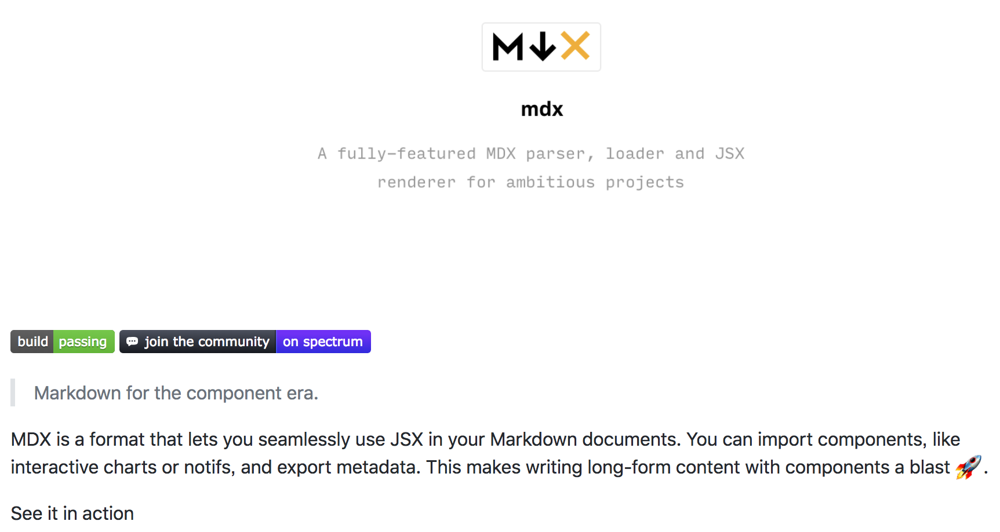
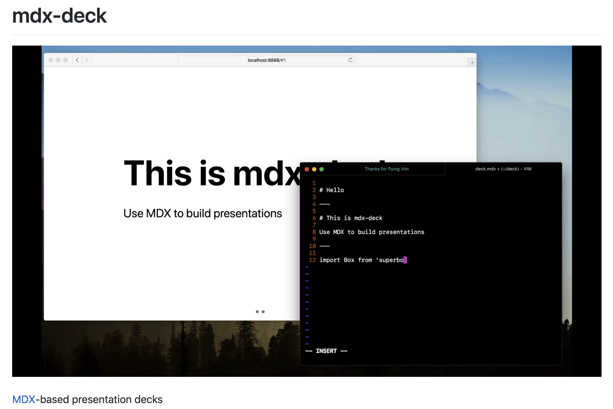
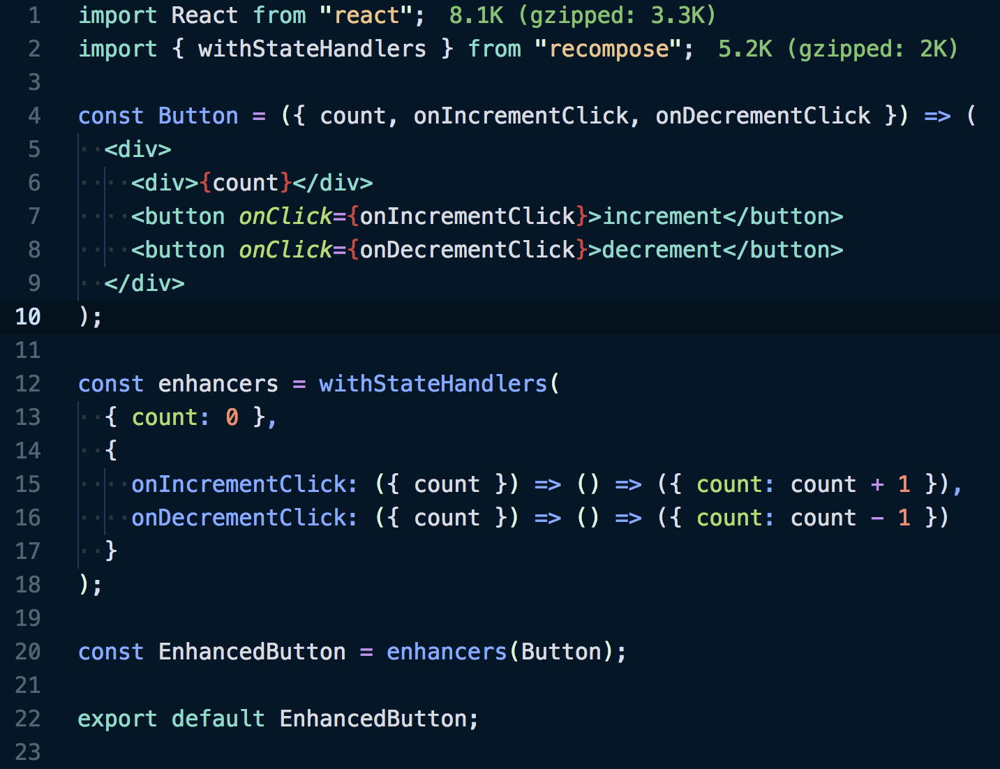

## 🤗 Hello Globis tech meetup 🤗

---

## 突然ですが

---

### LT / スライドを作る時って何を使ってますか？

- Keynote？
- Deckset？
- Marp？

---

# 🤔

---

# 😇 結構悩ましい

---

## 悩ましい / だるい

- GUI操作で作るのはしんどい
- Markdownで作れたらええやんけ
- Themeのカスタマイズ、CSS書くのダル杉内
- なんかかゆいところに手が届かない時がある

---

# ……。

---

# あれ？

---

# Markdownの中で Reactを書けたら…

---

# 書けたら…（病気）

---

---

# MDX

**JSX in Markdown** for ambitious projects

- https://mdxjs.com/

---

# :eyes: ほう

---

---

# mdx-deck

**MDX-based presentation decks**

- https://github.com/jxnblk/mdx-deck

---

# 🤤 ほう

---

## 機能も充分

- 📝 Write presentations in markdown
- ⚛️ Import and use React components
- 💅 Customizable themes and components
- 0️⃣ Zero-config CLI
- 💁 Presenter mode
- 📓 Speaker notes

---

## こう書いて

---

## `import` して使うと…

---

import EnhancedButton from './components/Button'

<EnhancedButton />

---

## 動くやんけ！！

---

# 雑感

- 今回はスライド作るために `mdx-deck` を使ったけど、ドキュメントサイトでも使えそう
- VSCode用に[プラグイン](https://github.com/silvenon/vscode-mdx)もあったよ

---

# 🎉 fin. 🎉
